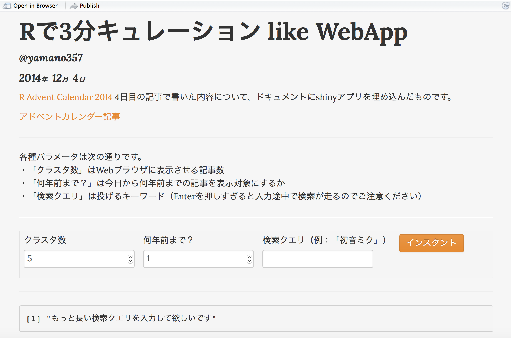

# はじめに
[R Advent Calendar 2014](https://atnd.org/events/58648) 4日目の記事です。

本日はRで言語処理という苦行にあえて挑戦し続けるyamano357が担当させていただきます。  
ここ数年でキュレーションアプリが広がりをみせ、論文の概要で「Webには膨大な記事があるのでまとめてー」とかなんとか書いていた研究室時代を懐かしく思う今日この頃。  
思い立ったので、「興味がありそうな記事をRのコードで手軽に集める」という内容をチャレンジしました。  

- やった内容  
1. クエリを投げてWebからテキスト集合を取得  
2. 取得したテキスト集合のうち、R上で文字化けしたテキストを除外  
3. 除外されずに残ったテキスト集合を形態素解析  
4. 各テキストから内容語のみを抽出し、また指定したストップワードを除去  
5. 文書単語頻度行列からテキスト間のコサイン類似度を計算  
4. 類似度を用いて文書クラスタリングして、クラスタ内でAUTHORITY値を算出  
5. 各クラスタからスコアを確率としてブートストラップサンプリング（結果に揺らぎをもたせるため）し、頻度が多い記事のヘッドラインとURLを返す  
6. URLをブラウザで開く  
7. ヘッドラインを表示

- 基本的には以前にTokyoRで発表した[テキスト自動要約の話](http://rpubs.com/yamano357/27317)と同じ方法を用いております。


---

---

# コード
## 定数定義
```{r def.constant}
kSetSentenceSep <- "\n" # 文の区切り
kSetContentPOS <- c("名詞", "動詞", "形容詞", "副詞") # 内容語とする品詞
kSetStopWord <- c("する", "ある", "なる", "いる", "こと", "れる") # 不要語扱いする内容語
kSetSampling <- 100 # ブートストラップサンプリング数 
kSetSleepTime <- 0.5 # ブラウザを開く際のスリープタイム（秒）
```

## パッケージ読み込み
```{r read.lib}
kSetLoadLibName <- c(
  "stringr", "tm", "tm.plugin.webmining", "RMeCab",
  "httr", "shiny",
  "proxy", "kernlab"
)
is.road.lib <- suppressPackageStartupMessages(
  sapply(kSetLoadLibName, library, character.only = TRUE, logical.return = TRUE)
)
stopifnot (is.road.lib)
```

## 関数定義
```{r def.func}
## 記号と名詞が多い文書は文字化けしていると定義
## 形態素解析を2回実行することになるのが無駄だけど、今回はこの仕様で
filterPageLogic <- function (content){
  content.morph <- lapply(content, function (input) {
    result <- try(RMeCabC(input, mypref = 1))
    if (class(result) == "try-error") {
      return (NULL) 
    } else {
      return (result)
    }
  })
  filter.freq <- sapply(content.morph, function (morph.vec) {
    morph <- names(unlist(morph.vec))
    return (
      list(
        "sign" = sum(is.element(morph, "記号")),
        "noun" = sum(is.element(morph, "名詞")),
        "other" =   sum(!is.element(morph, c("名詞", "記号")))
      )
    )
  })
  return (unlist(filter.freq["other", ]) > 0)
}

exePriProcess <- function (content) {
  return (
    lapply(
      strsplit(x = content, split = kSetSentenceSep),
      function (each.content) {
        return (
          lapply(
            each.content,
            function (each.sentence) {
              morph <- RMeCabC(each.sentence, mypref = 1)
              is.content <- is.element(names(unlist(morph)), kSetContentPOS)
              is.stop <- is.element(unlist(morph), kSetStopWord)
              return (unlist(morph)[is.content & !is.stop])
            }
          )
        )
      }
    )
  )
}

calcCosineSim <- function (doc.term) {
  return (
    1 - as.matrix(
      proxy::dist(x = as.matrix(
        t(tm::TermDocumentMatrix(
          x = tm::Corpus(x = tm::VectorSource(doc.term)), 
          control = list(
            removePunctuation = TRUE,
            removeNumbers = TRUE,
            tolower = TRUE
          )
        ))
      ), method = "cosine")
    )
  )
}

calcHITS <- function (target.mat) {
  hub <- abs(eigen(target.mat %*% t(target.mat))$vectors[, 1])
  auth <- abs(eigen(t(target.mat) %*% target.mat)$vectors[, 1])
  return (
    list(
      hub = hub / sum(hub),
      auth = auth / sum(auth)
    )
  )
}

```

## パラメータ設定（手打ち） 
```{r set.param}
## shinyUIから受け取っている変数をベタ書き
set.query <- "初音ミク"
set.prev.year <- 1
set.clus.num <- 5
```

---

## 実行部
```{r render.part}
## GoogleNewsからクエリにマッチするページ取得
## API利用に変更するかも
web.res <- WebCorpus(
  GoogleNewsSource(
    query = set.query, parame = list (hl = "ja", ie = "UTF-8")
  )
)

## ページ情報を抽出
meta.info <- lapply(web.res, "[[", "meta")
url <- sapply(sapply(meta.info, "[[", "origin"), function (origin){
  return (parse_url(origin)$query$url)
}, USE.NAMES = FALSE)
headline <- sapply(meta.info, "[[", "heading")
content <- sapply(web.res, "[[", "content")

## 除外対象テキストかどうかを判定
use.logic <- filterPageLogic(content)
date.logic <- sapply(lapply(meta.info, "[[", "datetimestamp"), as.character) >= (Sys.Date() - (365 * set.prev.year))

## 文字化けするページを除去（文字コード周りの処理は未実装）
url <- url[use.logic & date.logic]
content <- content[use.logic & date.logic]
headline <- headline[use.logic & date.logic]

## 形態素解析や内容語抽出、不要語除去
content.morph <- exePriProcess(content) 

## テキスト間の類似度計算
sim.mat <- calcCosineSim(content.morph)

## クラスタリングして、ランキングアルゴリズムを適用して、スコアを確率としたブートストラップサンプリング。
## 最大頻度のテキスト番号を取得
clus.res <- specc(x = sim.mat, centers = set.clus.num) @ .Data
clus.idx <- sapply(unique(clus.res), function (clus.num) {
  clus.index <- which(clus.res == clus.num)
  score <- calcHITS(sim.mat[clus.index, clus.index])$auth
  return (
    as.integer(
      names(
        which.max(
          table(
            sample(size = kSetSampling, x = clus.index, prob = score, replace = TRUE)
          )
        )
      )
    )
  )
})

## クラスタごとに選ばれたURLを開く
for (open.u in url[clus.idx]) {
  browseURL(open.u)
  Sys.sleep(kSetSleepTime)
}
```

## 実行結果
- rPubsではブラウザにてURLを開かない
```{r express.part}
print(headline[clus.idx])
```

---

---

# まとめ

パラメータ変更にインタラクティブに対応して、検索クエリにマッチしたWeb記事をブラウザに出力するというshinyアプリを埋め込んだ.Rmdを作成しようとしました。  
しかしながら、[ShinyApp.io](https://www.shinyapps.io)ではCRANやGitHubとBioConductorにあるパッケージしか使えなく（R-Forgeのパッケージもサポート予定。[要参照](http://shiny.rstudio.com/articles/shinyapps.html)）、形態素解析に用いているRMeCabが利用できませんでした（そもそもShinyApp.ioにMeCabがインストールできないのですが）。  
やむをえず、今回はパラメータを固定してRコードを記述しました。  
興味のある方は、パラメータを手で変更してコードブロックにあるRの処理を実行してみると面白いかもしれません。  

次はもっとRに寄った話をしたいと思います。  
師走は忙しいと体感しておりますが、皆様もお風邪などを召されないよう、ご養生くださいませ。  

---

---

# さらに興味があれば

ローカルでWebアプリ風に実行できる.Rmdを下記のGitにあげておきました。  

[RAdventCaledar2014_app.Rmd](https://github.com/yamano357/rPubs/)

RStudioで読み込んで、「Run Document」をクリックすると下記の図のようになります。  
パラメータを入力して「インスタント」ボタンを押すと処理が走り、WebブラウザにURLが投げられて表示されます。  
なお、実行するとコンソールにエラーが出力されてしまいますが仕様です。お気になさらずに。  

---



---

Rで言語処理をこなそうとするのは難しいですが、これからも続けていきたいと思います。  
来年もよろしくお願いいたします。

---

---

# 実行環境など

```{r info}
sessionInfo()
```

```{r date}
Sys.Date()
```
