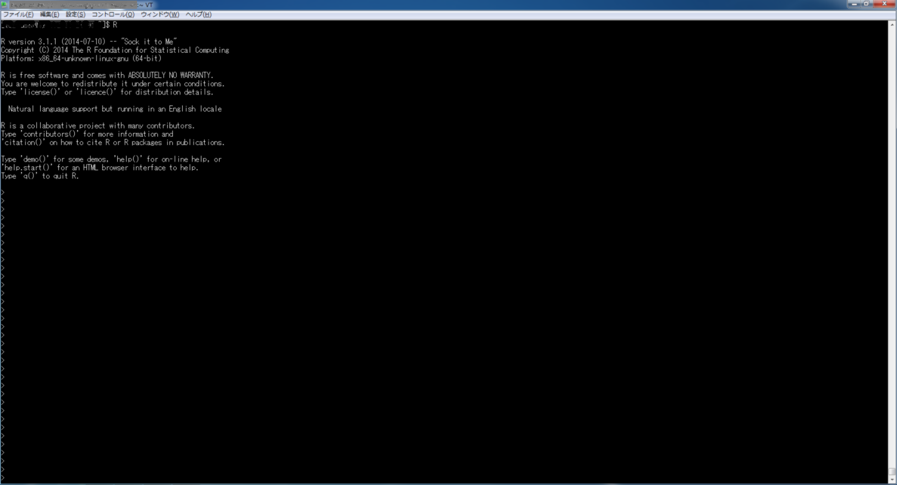
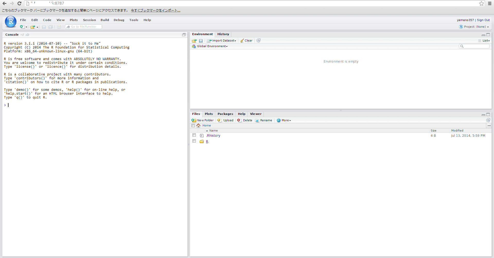

# 状況確認
* AWSのアカウントの取得済み
* EC2インスタンスの起動とか管理を忘れたときはこちら  
　http://recipe.kc-cloud.jp/archives/20
* RStudio Server版だけをAWSで手軽に使いたいときはこちら  
　http://rstudio-pubs-static.s3.amazonaws.com/3309_43edf277bce44d179d38858ba3725baf.html
* TeraTermでAmazon EC2に接続する方法を忘れたときはこちら  
　http://ds729.jp/life/archives/4563
* AndroidタブレットでAmazon EC2にSSH接続する方法を忘れたときはこちら  
　http://sudoovi.hatenablog.com/entry/2013/10/12/171444


# 作成環境
* AMI: Amazon Linux AMI 2014.03.2
* Instance Type: t2.micro
* R: 3.1.1
* RStudio Server版: 0.98.953-x86_64
* Shiny Server版: 1.2.0.359-x86_64


# Rをソースからインストール
* とりあえず必要そうなパッケージをかたっぱしからyumコマンドでいれる（CentOSだともっと多い）
```
> sudo yum install automake bison tetex texlive-latex texinfo-tex texlive* gcc gcc-c++ gcc-gfortran readline-devel cairo-devel libgfortran gcc-objc openssl-devel cpp libX* xorg-x11* java-1.7.0-openjdk-devel
```


* CRANからソースをダウンロードしてきて最適化とかスルーしてRをビルド
```
> curl -O http://cran.md.tsukuba.ac.jp/src/base/R-3/R-3.1.1.tar.gz
> tar -zxvf R-3.1.1.tar.gz
> rm R-3.1.1.tar.gz
> cd R-3.1.1
> ./configure --enable-R-shlib --enable-R-static-lib --enable-BLAS-shlib
> make
# > make check
> sudo make install
```


* 起動確認
```
> R
```



* OpenBLASで高速化したいとき（未検証）  
　http://cran.r-project.org/doc/manuals/r-devel/R-admin.html#Goto-and-OpenBLAS  
　http://r.789695.n4.nabble.com/R-with-openblas-and-atlas-td4679504.html
　http://www.kde.cs.tut.ac.jp/~atsushi/?p=263
```
# Rのディレクトリから移動しておく
> sudo yum install git
> git clone git://github.com/xianyi/OpenBLAS
> cd OpenBLAS
> make
# デフォルトだと/opt/OpenBLAS/libに
> sudo make install
# ダウンロードして解凍したソースのディレクトリへ戻っておく
# with-blasのオプションが正しいか確認していない（「-L/opt/OpenBLAS/lib」も必要か）
> ./configure --with-blas="-lopenblas" --enable-R-shlib --enable-R-static-lib --enable-BLAS-shlib
```


# RStudio Server版をインストール
* とりあえず必要そうなパッケージを（略）して、rpmファイルをダウンロード  
　http://www.rstudio.com/products/rstudio/download-server/
```
> sudo yum install python-devel rrdtool libcrypto.so.6 openssl098e
> curl -O http://download2.rstudio.org/rstudio-server-0.98.953-x86_64.rpm
```


* Amazon Linuxだと公式サイト通りにやるとlibR.so()が見つからないと言われる  
 https://support.rstudio.com/hc/communities/public/questions/200654056-Rstudio-server-does-not-work-on-a-fresh-Amazon-linux-instance  
 https://support.rstudio.com/hc/communities/public/questions/200639598-Running-rstudio-server-with-locally-compiled-R-
* ファイル検索すると見つかるのでR用に適当なファイルを作成してpathを書いておく  
　http://htrick.exblog.jp/5198045/  
　http://www.pictnotes.jp/wp/?p=292
```
# ファイル検索
# > find /usr/local/ | grep R.so
> vim /etc/ld.so.conf.d/R.conf
# 「/usr/local/lib64/R/lib」だけ記入して保存
```


* Rstudio Server版をインストールして、お好みで設定する  
　https://support.rstudio.com/hc/en-us/articles/200552306-Getting-Started
```
> sudo yum install --nogpgcheck rstudio-server-0.98.953-x86_64.rpm
> sudo rstudio-server verify-installation
# CentOSでやったときはiptablesの設定が必要だったが、設定なしでもアクセスできた
# http://<server-ip>:8787
# <server-ip>は「Public DNS」か、Elastic IP（紐づけていれば）
```



* Rstudio Serverの起動と停止
```
> sudo start rstudio-server
> sudo end rstudio-server
```


# Shiny Server版をインストール
* 公式サイト通りでエラーなく通るはず（アプリ作成して確認していない）  
　http://www.rstudio.com/products/shiny/download-server/
```
> sudo su - -c "R -e \"install.packages('shiny', repos='http://cran.rstudio.com/')\""
> curl -O http://download3.rstudio.org/centos-5.9/x86_64/shiny-server-1.2.0.359-x86_64.rpm
> sudo yum install --nogpgcheck shiny-server-1.2.0.359-x86_64.rpm
```


* お好みで設定する  
　http://rstudio.github.io/shiny-server/latest/
　http://tech-sketch.jp/2014/03/shiny-rweb.html


# ECインスタンスで設定しておくこと
 http://www.agilegroup.co.jp/technote/ec2-initial-settings.html  

```
# タイムゾーン設定を日本に変更
> sudo cp /usr/share/zoneinfo/Japan /etc/localtime

# 個人用アカウント作成
> sudo useradd yamano357
> sudo passwd yamano357
```
